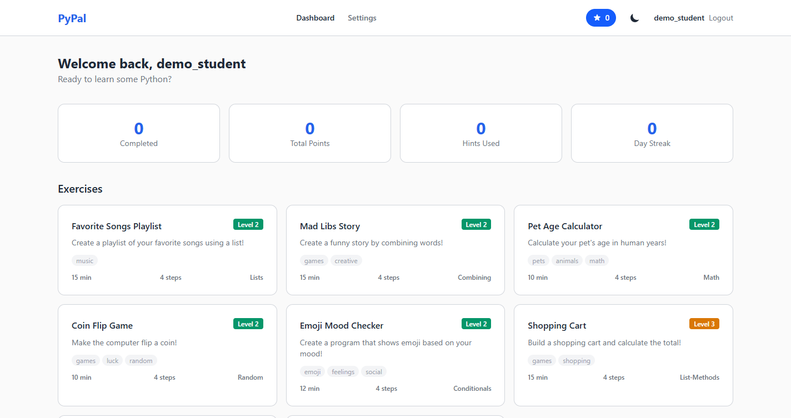
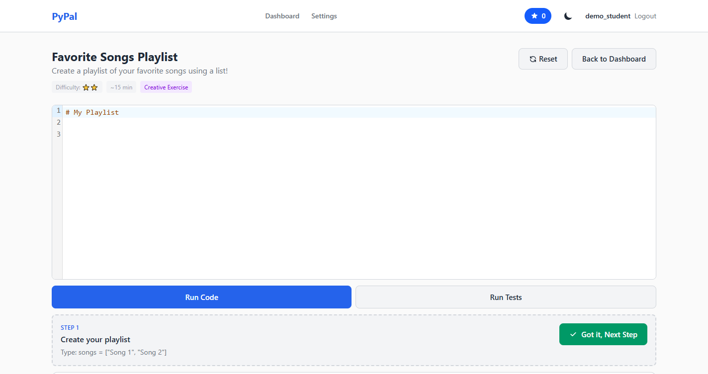
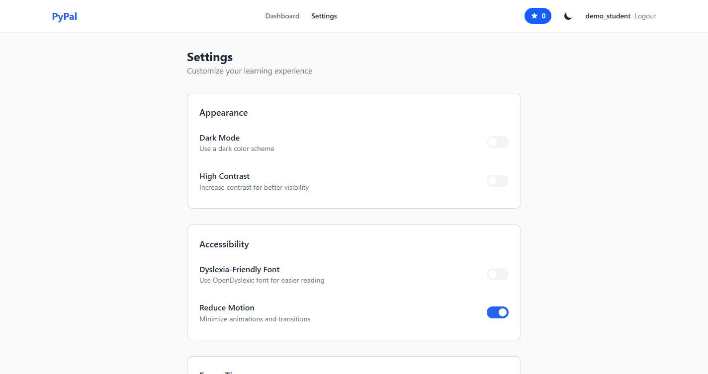
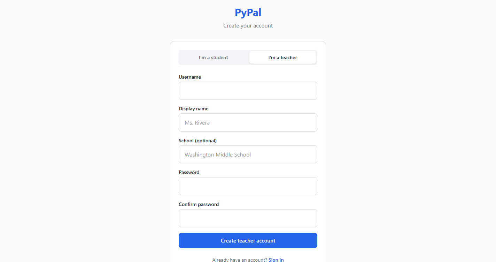
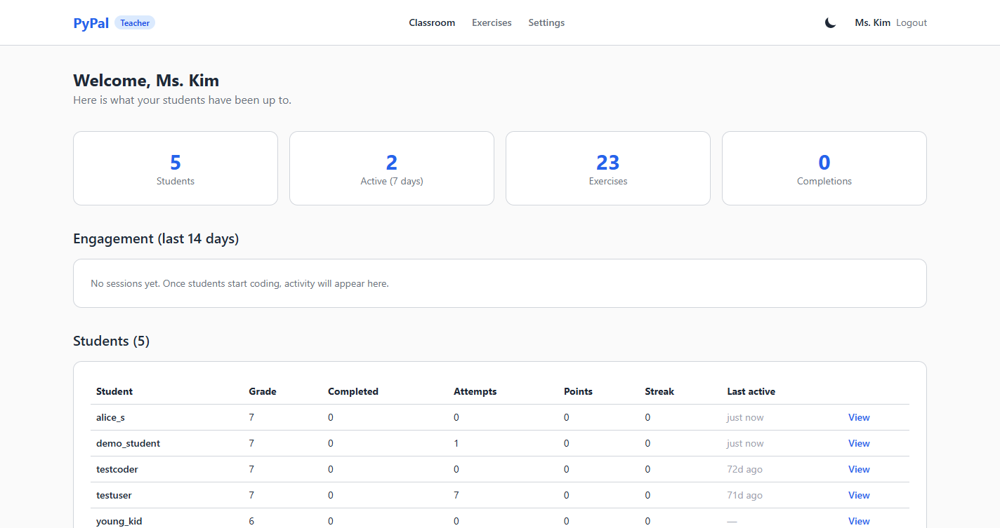
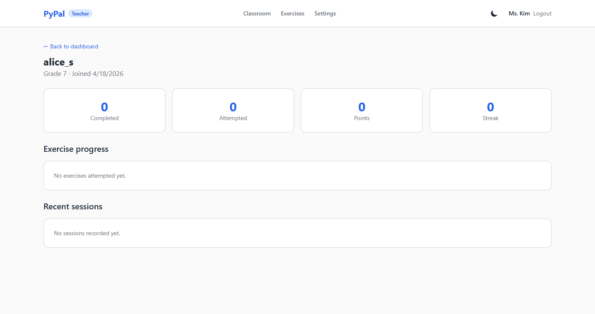
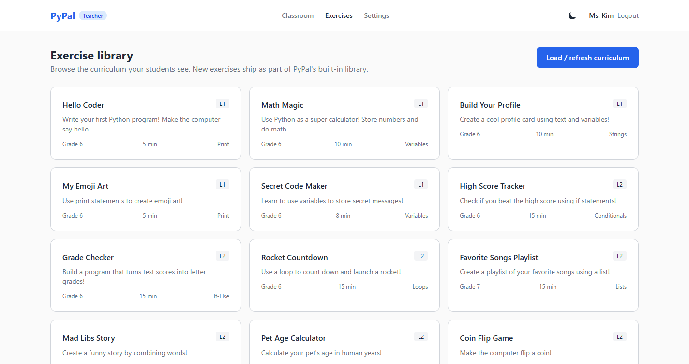
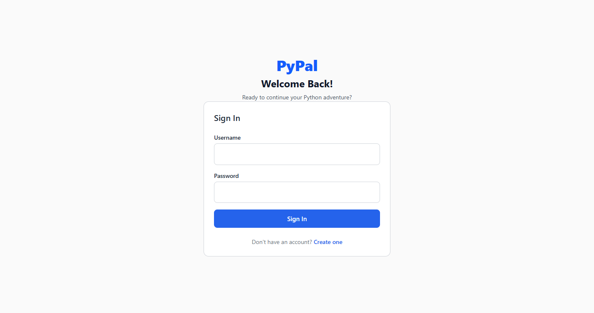
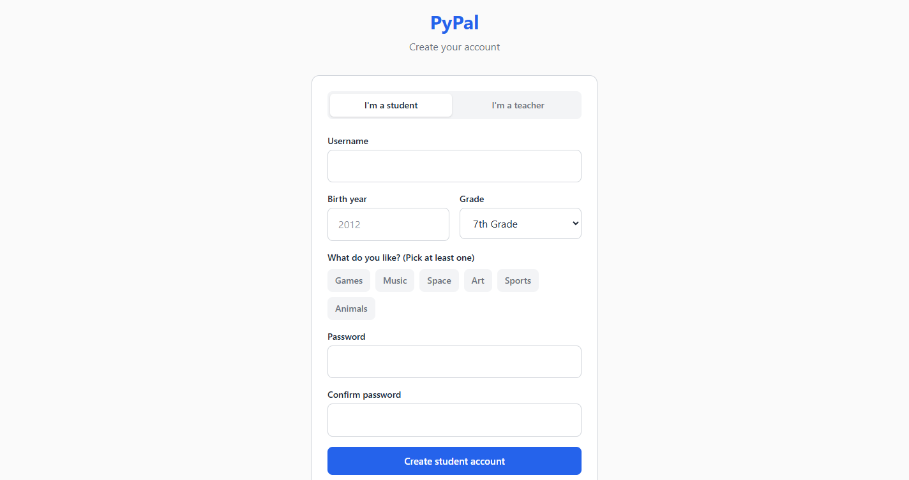

# PyPal

**A Python tutor for middle schoolers with ADHD.**

PyPal is a learning platform I built because the kids I was tutoring kept
running into the same wall: they understood the ideas, they were clever, but a
big wall-of-text problem would make them stall out before they'd even typed
anything. So PyPal takes each problem and splits it into small, clearly-labelled
steps. When a student gets stuck, they can ask for hints that start gentle and
slowly walk them closer to the answer. When they ship a step, they see it. That
small loop — **read a step → try it → see it light up green** — is the whole
idea.

This project is for **RESPECT 2026** (the IEEE *Research on Equity and Sustained
Participation in Engineering, Computing, and Technology* conference). That
conference is about making computing more accessible and equitable, especially
for students who've historically been pushed out or left behind. Kids with ADHD
are absolutely in that group — they often get labelled "not focused enough for
code" when the reality is that most coding tools weren't designed with their
attention patterns in mind.

PyPal is a small attempt to change that.

> The actual application code lives in [`neurocode/`](neurocode/) (the folder
> is still called that for historical reasons — see "Why PyPal" below).

---

## What it looks like

### Student experience

When a student logs in, they get a simple dashboard with the exercises they can
try. Every card tells them three things up front: how long it'll take, how many
steps it has, and what concept it covers. No hunting, no walls of prose.



Inside an exercise, the layout is deliberately quiet. Editor on the left,
progress tracker on the right. A single step at a time. If they finish a
"reading" step they hit **Got it, Next Step**. If it's a coding checkpoint,
they hit **Run Tests** — and only when the tests pass do they move on. No
surprises, no skipped state.



Settings let students turn on accessibility features they actually need —
OpenDyslexic font, high contrast, reduced motion, longer or shorter focus
sessions. The defaults lean ADHD-friendly (motion off, 20-minute break
reminders).



### Teacher experience

Teachers get a separate view. They sign up on the same page — there's a tab at
the top of the sign-up form — and the app routes them to a classroom dashboard
instead of the student dashboard.



The classroom dashboard answers the question a middle-school CS teacher
actually has: *who in my class is stuck right now?* Four headline numbers
(students, active this week, exercises in the library, total completions), a
two-week engagement bar chart, and a table of every student with their
completion counts, streak, and last-seen time.



Clicking into a student shows their progress exercise-by-exercise, plus their
recent sessions (including how often they signalled frustration). If a student
has been frustrated a lot recently, the page surfaces a small "Heads up" banner
so teachers can decide whether to check in.



Teachers can also browse the built-in curriculum from the Exercises page, and
re-seed it with one click if they want to pull in updates.



### Sign-in and sign-up

The login page is intentionally boring — username and password, the warmest
copy I could get away with, and a link to create an account. The sign-up page
handles the tricky COPPA case (students under 13 need a parent's email to
trigger a consent flow) without making that feel like a cliff for the kid.




---

## How it works (under the hood)

PyPal is two pieces that talk over a JSON API:

- **Backend** — FastAPI + SQLAlchemy (async), SQLite for local dev,
  Google Gemini for the tutor's language model.
- **Frontend** — React 19 + Vite + TypeScript, Tailwind CSS v4, Zustand for
  state, CodeMirror for the editor, React Router for page-level routing.

The interesting bits are:

- **Micro-task decomposition.** When a student opens an exercise, if the
  curriculum author didn't pre-split the steps, the backend asks Gemini to
  break the problem into 4–6 small steps. Each step is tagged either
  "read" (just understand it, click through) or "checkpoint" (write code and
  pass the test to advance).
- **Escalating hints.** There's a four-level hint system. Level 1 is a gentle
  "have you tried…?" nudge. By level 4 it's basically walking the student
  through the fix. Hints cost points, which pushes kids to try something on
  their own first, but they're never locked out.
- **Frustration detection.** If the student's messages contain words like
  "stuck", "confused", "hard", the backend quietly logs a frustration event.
  Teachers see those counts on the student-detail page.
- **Role-aware routing.** Students and teachers share the same app but see
  completely different navigation. The backend enforces this with a
  `require_teacher` dependency; the frontend enforces it with
  `<StudentOnly>` / `<TeacherOnly>` route guards so teachers can't accidentally
  end up in a student's exercise flow and vice-versa.

## COPPA, briefly

PyPal asks students their birth year. If they're under 13, the backend won't
create a usable account until a parent clicks the consent link. The consent
token is a signed JWT that expires in 7 days. Until that link is clicked the
student can't log in — they'll see a "waiting for your parent" page instead of
a generic error. Research consent (for analytics to be used in the RESPECT
paper) is a separate checkbox from platform consent.

---

## Running it locally

You'll need Python 3.11+ and Node.js 18+.

**1. Grab a Gemini API key.** Free tier is fine:
<https://ai.google.dev/>

**2. Backend**

```bash
cd neurocode/backend
pip install -e ".[dev]"
echo "GEMINI_API_KEY=your_key_here" > .env
python -m uvicorn app.main:app --reload
```

The backend lives at `http://127.0.0.1:8000`. Swagger docs are at `/docs`.

**3. Frontend**

In a second terminal:

```bash
cd neurocode/frontend
npm install
npm run dev
```

Open `http://localhost:5173`. Vite is proxying `/api` to the backend, so you
don't need to mess with CORS.

**4. Load the curriculum** (first time only). Any teacher account can do this
from the Exercises page by clicking **Load / refresh curriculum**. Or via
curl:

```bash
curl -X POST http://127.0.0.1:8000/api/admin/seed-exercises
```

That seeds 23 ADHD-friendly exercises — playlists, mood checkers, pet
calculators, coin-flip games. Deliberately interest-driven so the "why would I
ever do this" question doesn't come up.

---

## Running the tests

Backend:

```bash
cd neurocode/backend
python -m pytest
```

274 tests at last count — registration flows, COPPA edges, code-runner
safety, role-based access control, the full curriculum, a chunk of
"human-perspective" tests that pretend to be an ADHD middle schooler (typos,
abandoning halfway, clicking too many hint buttons).

Frontend:

```bash
cd neurocode/frontend
npm test
```

48 component + accessibility + edge-case tests.

---

## Project layout

```
PyPalRespect/
├── README.md                    (this file)
├── neurocode/                   main application
│   ├── backend/
│   │   └── app/
│   │       ├── main.py              FastAPI entry point
│   │       ├── config.py            Environment settings
│   │       ├── database.py          Async SQLAlchemy + lightweight migrations
│   │       ├── models/              User, Session, Exercise, Progress
│   │       ├── schemas/             Pydantic request/response types
│   │       ├── routers/
│   │       │   ├── auth.py          Login, register (student & teacher)
│   │       │   ├── tutor.py         Chat, hints, task decomposition
│   │       │   ├── exercises.py     Listing, running, testing, progress
│   │       │   ├── progress.py      Per-student progress + sessions
│   │       │   ├── teacher.py       Classroom overview + student detail
│   │       │   └── admin.py         Seeder + aggregate analytics
│   │       ├── services/            Gemini, hints, decomposer, analytics
│   │       ├── prompts/             The tutor's system prompts (readable!)
│   │       └── data/curriculum.py   The built-in 23-exercise library
│   ├── frontend/
│   │   └── src/
│   │       ├── App.tsx              Role-based routing
│   │       ├── pages/               Login, Register, Dashboard, Exercise,
│   │       │                        Settings, ConsentPending, Teacher* pages
│   │       ├── components/
│   │       │   ├── layout/          Role-aware MainLayout
│   │       │   ├── editor/          CodeMirror wrapper + OutputPanel
│   │       │   ├── tutor/           TutorChat + HintPanel
│   │       │   └── adhd/            StepProgress, FocusTimer, PointsDisplay
│   │       ├── services/api.ts      Typed API client
│   │       └── stores/              Zustand stores (auth, theme, timer)
│   ├── docs/screenshots/            The images used in this README
│   └── scripts/take_screenshots.py  Selenium script that captures them
├── research/                    RESPECT paper drafts + diagrams
└── scripts/                     helper scripts
```

---

## The roles, in one sentence each

| Role | What they see | What they can do |
|------|---------------|------------------|
| Student | `/dashboard`, `/exercise/:id`, `/settings` | Work exercises, track their own progress, take breaks, ask for hints |
| Teacher | `/teacher`, `/teacher/students/:id`, `/teacher/exercises`, `/settings` | See every student's progress, browse the curriculum, spot frustration trends |

Backend guards the teacher endpoints with a role check; the frontend guards
the teacher pages with a route-level component. Either guard alone would be
enough to block casual access — together they make role mixing very hard to do
by accident.

---

## Why "PyPal"

Originally this was called NeuroCode. I renamed it because "pal" felt closer
to what I actually wanted a student to feel while using it — something on
their side, low-stakes, friendly — and "Py" makes the "it teaches Python" part
obvious without needing subtext. The repo still contains a folder called
`neurocode/` because renaming directories mid-project is the kind of thing
you regret the next day when someone asks you to merge a branch.

---

## Acknowledgements

- The RESPECT 2026 community, whose framing of "sustained participation"
  pushed me to care less about flashy demos and more about whether a kid
  comes back the next day.
- My tutoring students, who are the actual reason anything in this repo
  exists. Several of the design choices in here are literally because one of
  them asked "why is there so much text on the screen?" while I watched them
  try to solve a problem.
- Google Gemini for the free API tier that makes this possible on a
  student-teacher budget.

---

## License

This project is shared under the MIT License for the RESPECT 2026 research
community. If you use pieces of it in your own work, a citation back to this
repo would be appreciated but isn't required.
